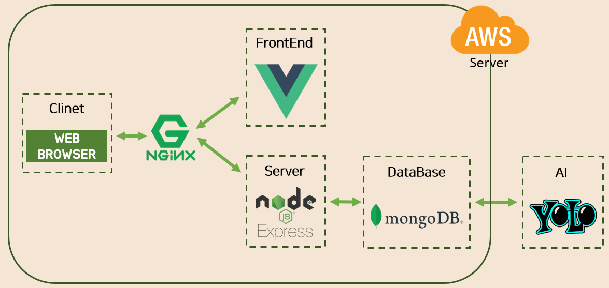

[TOC]

# TamTamLens

## 1. 주요 역할 및 기술 

#### 1) 주요 역할

> **BackEnd** 개발 => node.js, mongoDB 사용 
>
> **AI**를 이용한 이미지 학습 => YOLO 


#### 2) Architecture




## 2. TamTamLens란 ? :smiley:

```
비디오 스트리밍에 등장하는 브랜드 노출을 인식하여 기업에게 데이터를 제공해주는 B2B 서비스
```


## 3. 추진 배경

#### 1) 비디오 스트리밍 시대


#### 2) 비디오 스트리밍을 통한 광고 증가


## 3. YOLO를 이용한 이미지 학습 결과


## 4. 기능 설명

